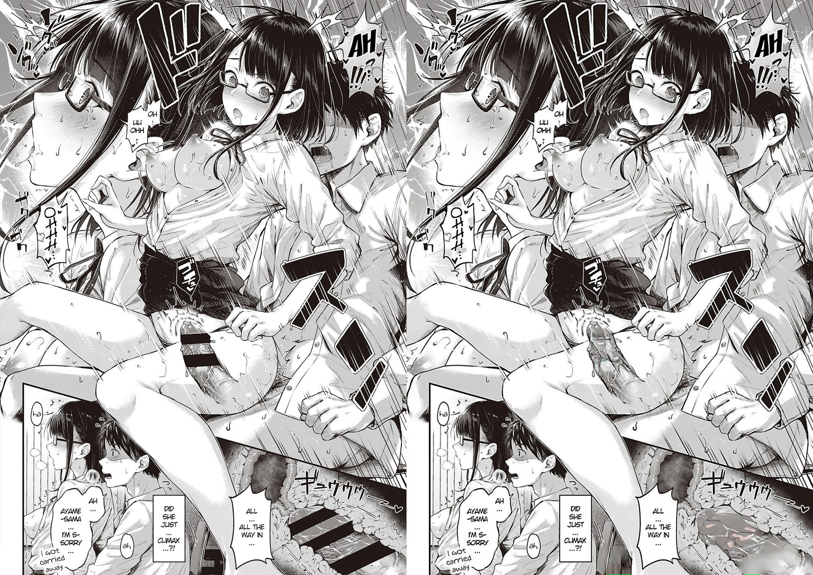

# DoujinCI

Automated pipeline to decensor doujins with bars or mosaics using modified versions of natethegreate's HentAI and deeppomf's DeepCreamPy.
Provide a link or 6-digit id to the pipeline, and it will spit out decensored images in the artifacts of the pipeline job.

The output is usually imperfect (either missing some parts, or green leftover), but usually much better than no processing, especially considering it's all automated.

NSFW before/after comparisons

Bars:

Mosaics:

 

# Instructions
GitLab pipelines can either run on shared job runners, owned by GitLab, or runners that you make for yourself "specific runners".
I don't intend for other people to run pipelines on my repo. You should fork this repo (or copy the sourcecode and upload it to GitLab), 
and then run pipelines on your own shared or specific runners. I've personally set up my own runner on my computer with docker, which was a hassle but ultimately means
I'm not limited by GitLab's restricted run minutes. The process to make your own runner is in the documentation: https://docs.gitlab.com/runner/.

With that said, here is how you run a pipeline, once you have your own repo/optional runner:

1. On the GitLab repo sidebar, click CI/CD->Pipelines
2. Click "Run pipeline" in the top right. You'll see a screen that allows you to enter variables to form the pipeline's functionality.
In the variables, you can add key:value pairs. You put the key in the left field and the value in the right field.
3. Put `LINKORID` as a key and the link or id of the comic as the value
4. The pipeline defaults to bar censorship, if yours has mosaics, put `BARORMOSAIC` as a key and `mosaic` as the value.
5. The pipeline defaults to averaging out pictures to remove [screentones](https://en.wikipedia.org/wiki/Screentone). If you are sure that your comic
doesn't have screentones, you can set `STREMOVE` to `false`. If you set it to false and screentones are in your comic, then the output will be bad and time will be wasted.
6. Click "Run pipeline"
7. Wait for the AI and Py jobs to finish. When they're done (and successful), click through to the Py job, and on the right middle of the screen
click Download on the Job artifacts. This will be a zip with the decensorred images. 
8. Any errors will be printed out in the AI or Py jobs. You can use these error messages to figure out what's wrong.

# Backstory
In the space of automated comic decensoring, two tools, [HentAI](https://github.com/natethegreate/hent-AI) (AI) and [DeepCreamPy](https://portrait.gitee.com/1436159772/DeepCreamPy/tree/master) (DCP) have existed for a while. The former 
finds bars or mosaics and colours them, and was made to work with the latter, which
fills in those coloured bars. Even though these two complimentary tools exist, using even one of them is a challenge,
as they require Python familiarity, aren't actively supported by their creators, and have lots of dependency bugs in them. I personally had a lot of trouble trying to use them.

What I've done is assembled the best versions of AI and DCP, ironed out the packages and abstracted away all the complexity into a Gitlab CI pipeline. You provide the URL,
and the pipeline spits out the decensored pictures after 15-30 minutes. 

AI and Py are amazing work that I cannot take for credit for. However, as I said, using them before was clunky, and the code
for both was very messy as they invented their own individual front-end GUIs to operate their algorithms. My work involved
getting rid of all the messy front-ends, revealing only the logic underneath. I also wanted to skip the step where you had to manually
download all the pictures yourself and convert them to pngs, so I wrote custom code to do both.

I take credit for thinking of using Gitlab CI to do this. Doing so has the advantage that
I can use Python Docker images (image: python:3.5) and requirements files to make these normally finicky tools far more reliable.
You could copy this repo and change pretty much nothing, and it would work on another Gitlab repo, whereas the same can't be same for the source code.

# Limitations
The free tier of Gitlab CI only allows 400 pipeline minutes per month. 
The decensorring is not perfect, it'll sometimes miss bars and mosaic decensorring is not always good. However, running a censored
comic through this pipeline improves it significantly.
